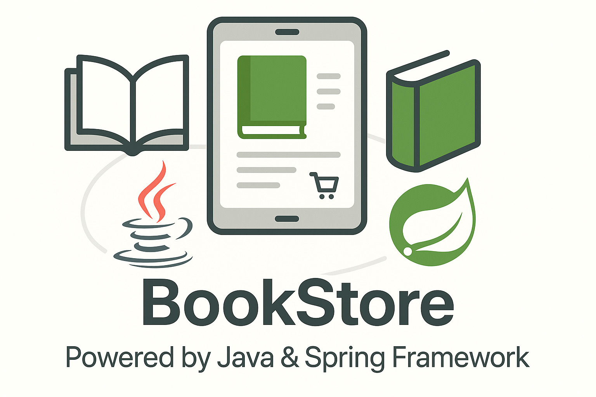

# Book Store API

## 📚 Bringing the Bookstore Experience Online

In today's digital age, the way we discover and purchase books has fundamentally changed. 
The Book Store API was born from a passion to create a seamless online book shopping experience 
that rivals the charm of browsing physical bookstores. This project aims to bridge the gap between 
traditional book shopping and the convenience of e-commerce, providing a robust backend that 
powers modern book discovery and purchasing.

This comprehensive RESTful API, built with Spring Boot, offers a complete solution for 
online bookstores, enabling efficient management of books, categories, users, shopping carts, 
and orders. Whether you're building a small independent bookstore application or scaling to 
a larger e-commerce platform, this API provides the foundation you need.



## Table of Contents
- [Features](#features)
- [Technologies Used](#technologies-used)
- [API Endpoints](#api-endpoints)
- [Getting Started](#getting-started)
  - [Prerequisites](#prerequisites)
  - [Installation](#installation)
  - [Running with Docker](#running-with-docker)
- [API Documentation](#api-documentation)
- [Project Structure](#project-structure)
- [Database Schema](#database-schema)
- [Security](#security)
- [Challenges and Solutions](#challenges-and-solutions)

## Features

- **User Management**: Registration, authentication, and authorization with JWT
- **Book Management**: CRUD operations for books with categories
- **Category Management**: Organize books by categories
- **Shopping Cart**: Add, update, and remove items from shopping cart
- **Order Processing**: Create and manage orders with different statuses
- **Security**: Role-based access control with Spring Security
- **API Documentation**: Swagger UI for easy API exploration

## Technologies Used

Our Book Store API leverages a modern tech stack to deliver a robust, scalable, 
and maintainable solution:

### Backend Framework
- **Java 17**: Utilizing the LTS version with enhanced features like records, 
  pattern matching, and improved performance
- **Spring Boot 3.4.3**: Providing a production-ready framework with auto-configuration, 
  standalone capabilities, and a rich ecosystem

### Data Management
- **Spring Data JPA**: Simplifying database operations with repository abstractions and 
  reducing boilerplate code
- **Hibernate**: Powerful ORM implementation for object-relational mapping
- **MySQL**: Reliable and scalable relational database for production environments
- **Liquibase**: Managing database schema changes with version control, allowing for 
  seamless migrations across environments
- **H2 Database**: In-memory database for testing, ensuring isolation and fast test execution

### Security
- **Spring Security**: Comprehensive security framework providing authentication, 
  authorization, and protection against common vulnerabilities
- **JWT (JSON Web Token)**: Enabling stateless authentication with secure, compact, 
  and self-contained tokens
- **Role-based Access Control**: Implementing fine-grained permissions based on user 
  roles (USER, ADMIN)

### Development Tools
- **Docker**: Containerizing the application and its dependencies for consistent 
  deployment across environments
- **Maven**: Managing dependencies and build lifecycle with a robust and widely-adopted tool
- **Lombok**: Reducing boilerplate code with annotations for getters, setters, 
  constructors, and more
- **MapStruct**: Efficient and type-safe object mapping between DTOs and domain models

### API Documentation
- **SpringDoc OpenAPI**: Automatically generating comprehensive API documentation
- **Swagger UI**: Providing an interactive interface to explore and test API endpoints

## API Endpoints

The Book Store API provides a comprehensive set of endpoints organized by domain:

### Authentication API
- **POST /auth/registration**: Register a new user
- **POST /auth/login**: Authenticate a user and receive a JWT token

### Book API
- **GET /books**: Retrieve all books (paginated) - *Requires authentication*
- **GET /books/{id}**: Retrieve a specific book by ID - *Requires authentication*
- **POST /books**: Create a new book - *Requires ADMIN role*
- **PUT /books/{id}**: Update an existing book - *Requires ADMIN role*
- **DELETE /books/{id}**: Delete a book - *Requires ADMIN role*
- **GET /books/search**: Search books by title, author, or ISBN - *Requires authentication*

### Category API
- **GET /categories**: Retrieve all categories (paginated) - *Requires authentication*
- **GET /categories/{id}**: Retrieve a specific category - *Requires authentication*
- **POST /categories**: Create a new category - *Requires ADMIN role*
- **PUT /categories/{id}**: Update an existing category - *Requires ADMIN role*
- **DELETE /categories/{id}**: Delete a category - *Requires ADMIN role*
- **GET /categories/{id}/books**: Retrieve all books in a specific category - *Requires authentication*

### Shopping Cart API
- **GET /cart**: Retrieve the current user's shopping cart - *Requires USER role*
- **POST /cart**: Add a book to the shopping cart - *Requires USER role*
- **PUT /cart/{itemId}**: Update the quantity of an item in the cart - *Requires USER role*
- **DELETE /cart/{itemId}**: Remove an item from the cart - *Requires USER role*

### Order API
- **GET /orders**: Retrieve the user's order history - *Requires USER role*
- **POST /orders**: Create a new order from the shopping cart - *Requires USER role*
- **GET /orders/{orderId}/items**: Retrieve all items in a specific order - *Requires USER role*
- **GET /orders/{orderId}/items/{itemId}**: Retrieve a specific item from an order - *Requires USER role*
- **PATCH /orders/{orderId}**: Update the status of an order - *Requires ADMIN role*

## Getting Started

This section provides detailed instructions to get the Book Store API up and running 
on your local machine for development and testing purposes.

### Prerequisites

Before you begin, ensure you have the following installed:

- **Java 17 or higher**: Required for running the Spring Boot application
  - Download from [Oracle](https://www.oracle.com/java/technologies/downloads/) or use [OpenJDK](https://openjdk.java.net/)
  - Verify installation with `java -version`

- **Maven 3.6 or higher**: For dependency management and building the project
  - Download from [Maven's official site](https://maven.apache.org/download.cgi)
  - Verify installation with `mvn -version`

- **Docker and Docker Compose**: For containerized deployment (optional but recommended)
  - Install [Docker Desktop](https://www.docker.com/products/docker-desktop) (includes Docker Compose)
  - Verify installation with `docker --version` and `docker-compose --version`

- **MySQL 8.0** (optional if using Docker): For local database development
  - Download from [MySQL's official site](https://dev.mysql.com/downloads/)
  - Alternatively, use the Docker configuration provided

### Installation

1. **Clone the repository**:
   ```bash
   git clone https://github.com/yourusername/book-store.git
   cd book-store
   ```

2. **Configure environment variables**:

   Create a `.env` file in the root directory with the following content (or copy from `.env.sample`):
   ```
   # Database Configuration
   MYSQL_USER=book_user
   MYSQL_PASSWORD=book_pass
   MYSQL_ROOT_PASSWORD=rootpassword
   MYSQL_DB=bookstore
   MYSQL_LOCAL_PORT=3307
   MYSQL_DOCKER_PORT=3306

   # Application Configuration
   SPRING_LOCAL_PORT=8080
   SPRING_DOCKER_PORT=8080
   DEBUG_PORT=5005
   ```

3. **Build the application**:
   ```bash
   mvn clean package
   ```

4. **Run the application locally** (without Docker):

   a. Set up a local MySQL database with the credentials specified in your `.env` file

   b. Run the application:
   ```bash
   java -jar target/book-store-0.0.1-SNAPSHOT.jar
   ```

   c. The application will be available at `http://localhost:8080`

### Running with Docker

Docker provides an isolated environment with all dependencies pre-configured, 
making it the recommended way to run the application.

1. **Build and start the containers**:
   ```bash
   docker-compose up -d
   ```
   This command:
   - Creates a MySQL container with the configured credentials
   - Builds and starts the Spring Boot application container
   - Sets up networking between the containers
   - Exposes the application on the configured port

2. **Verify the application is running**:
   - The application will be available at `http://localhost:8080`
   - Access Swagger UI at `http://localhost:8080/swagger-ui.html`
   - Check container status with `docker-compose ps`

3. **View application logs**:
   ```bash
   docker-compose logs -f app
   ```

4. **Stop the containers**:
   ```bash
   docker-compose down
   ```

5. **Clean up resources** (optional):
   ```bash
   docker-compose down -v --rmi all
   ```
   This removes containers, volumes, and images created by docker-compose.

## API Documentation

Once the application is running, you can access the Swagger UI documentation at:
```
http://localhost:8080/swagger-ui.html
```

This provides a comprehensive interface to explore and test all available API endpoints.

## Project Structure

The project follows a standard layered architecture:

- **Controller Layer**: Handles HTTP requests and responses
- **Service Layer**: Contains business logic
- **Repository Layer**: Manages data access
- **Model Layer**: Defines the domain entities
- **DTO Layer**: Data Transfer Objects for API requests and responses
- **Mapper Layer**: Maps between entities and DTOs
- **Security**: Handles authentication and authorization
- **Exception Handling**: Global exception handling for consistent error responses

## Database Schema

The application uses MySQL as the primary database with the following main entities:

- **User**: Stores user information and credentials
- **Role**: Defines user roles for authorization
- **Book**: Contains book details
- **Category**: Organizes books into categories
- **ShoppingCart**: User's shopping cart
- **CartItem**: Items in a shopping cart
- **Order**: User orders
- **OrderItem**: Items in an order

Database migrations are managed with Liquibase, ensuring consistent schema across environments.

## Security

The application uses Spring Security with JWT for authentication and authorization:

- **Authentication**: Users can register and login to receive a JWT token
- **Authorization**: Role-based access control for API endpoints
- **Token-based**: JWT tokens are used for stateless authentication

## Challenges and Solutions

During the development of the Book Store API, we encountered several challenges and implemented 
effective solutions:

### Challenge 1: Implementing Soft Delete

**Problem**: Deleting records permanently could lead to data integrity issues and make it 
impossible to recover accidentally deleted data.

**Solution**: Implemented a soft delete mechanism using Hibernate filters:
- Added an `isDeleted` flag to entities
- Used `@SQLDelete` and `@SQLRestriction` annotations to automatically handle soft deletes
- This approach maintains data integrity while allowing for data recovery if needed

### Challenge 2: Managing Entity Relationships

**Problem**: When deleting categories, we needed to handle the many-to-many relationship 
with books properly.

**Solution**: Implemented a transactional method in `CategoryServiceImpl` that:
- Finds all books associated with the category
- Removes the category from each book's collection
- Saves the updated books
- Then deletes the category
- This approach prevents orphaned relationships and maintains data consistency

### Challenge 3: Securing API Endpoints

**Problem**: Different endpoints required different levels of access control.

**Solution**: Implemented a role-based security model using Spring Security:
- Created USER and ADMIN roles with appropriate permissions
- Used method-level security with `@PreAuthorize` annotations
- Implemented JWT for stateless authentication
- This approach provides fine-grained access control while maintaining a good user experience

### Challenge 4: Optimizing Database Queries

**Problem**: N+1 query problem when fetching books with their categories.

**Solution**: Used JPA Entity Graphs to optimize fetching:
- Created named entity graphs for common fetch scenarios
- Applied entity graphs in repository methods
- This approach significantly reduced the number of database queries and improved performance
